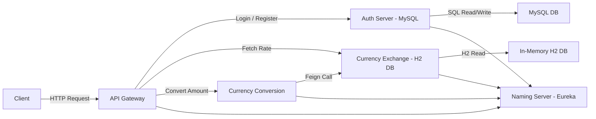

# Microservices Spring Cloud Project - Complete with JWT Auth

This is a microservices-based project demonstrating a simple currency exchange and conversion system, JWT-based authentication, and API routing via a gateway. Everything is containerized using Docker for easy deployment.

---

## Services Overview

1. **currency-exchange**  
   - Stores currency exchange rates from USD, EUR, GBP to INR.  
   - Uses an **in-memory H2 database**.  

2. **currency-conversion**  
   - Fetches exchange rates from `currency-exchange` using **Feign clients**.  
   - Calculates the INR equivalent for a given amount in USD, EUR, or GBP.  

3. **api-gateway**  
   - Routes all requests to underlying microservices.  
   - Runs at **port 8765**.  

4. **naming-server (eureka)**  
   - Service discovery for all microservices.  

5. **auth-server**  
   - Provides JWT-based authentication.  
   - Simple username/password login.  
   - Uses **MySQL** container to store credentials.  

---

## Available Endpoints (via API Gateway)

All links are routed through the **API Gateway**:

- **Authentication**  
  - Login: [http://localhost:8765/auth/login](http://localhost:8765/auth/login)  
  - Registration: [http://localhost:8765/auth/register](http://localhost:8765/auth/register)  

- **Currency Exchange**  
  - Fetch exchange rate: `http://localhost:8765/currency-exchange/from/{currency}/to/{currency}`  

- **Currency Conversion**  
  - Convert amount: `http://localhost:8765/currency-conversion-feign/from/{currency}/to/{currency}/quantity/{amount}`  

---

## Containers

The project consists of **6 containers**:

1. currency-exchange  
2. currency-conversion  
3. api-gateway  
4. eureka-server  
5. auth-server  
6. MySQL DB for auth-server  

---

## Run It Yourself

Make sure you have **Docker** and **Docker Compose** installed.  

Then, pull the required images:

1. `docker pull sumanthgma4/microservices-currency-exchange-service:0.0.1-SNAPSHOT`
2. `docker pull sumanthgma4/microservices-currency-conversion-service:0.0.1-SNAPSHOT`  
3. `docker pull sumanthgma4/microservices-api-gateway:0.0.1-SNAPSHOT`  
4. `docker pull sumanthgma4/microservices-naming-server:0.0.1-SNAPSHOT`  
5. `docker pull sumanthgma4/microservices-auth-server:0.0.1-SNAPSHOT`
6. `docker pull mysql:8.0`

Finally, boot up all containers:

```bash
docker compose up --build
```

Note: Make sure the docker-compose.yaml file is present and run the above command from the directory containing it.
This ensures all containers start correctly and services can communicate via the API Gateway.

